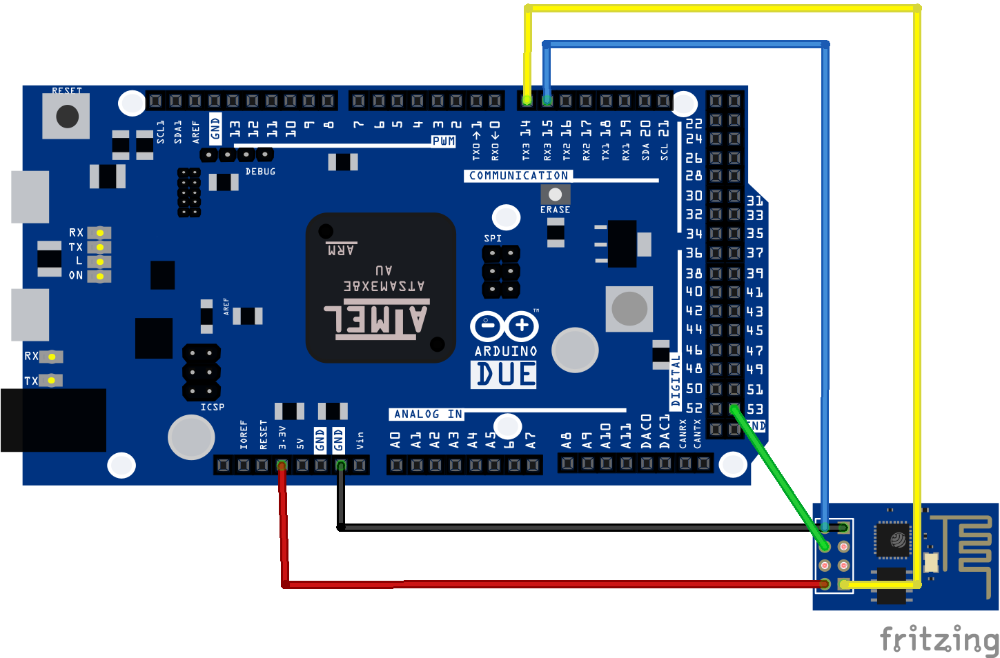

# Due-ESP8266
Using ESP8266 WiFi Module with Arduino Due.

Modified from: [https://arduino-er.blogspot.com/2015/04/connect-esp8266-wifi-module-to-arduino.html](https://arduino-er.blogspot.com/2015/04/connect-esp8266-wifi-module-to-arduino.html)

[ESP8266 - AT Command Reference](https://room-15.github.io/blog/2015/03/26/esp8266-at-command-reference/)

